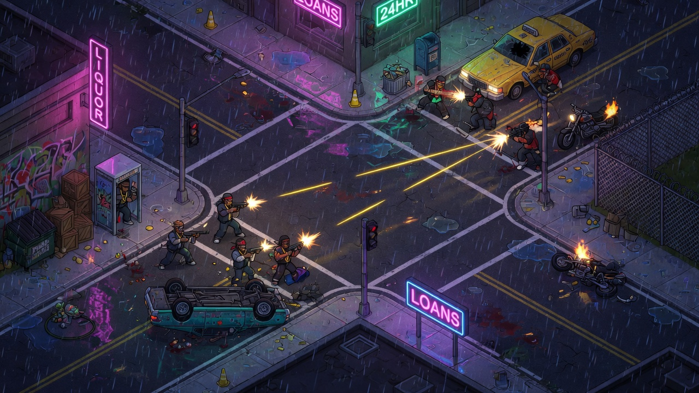
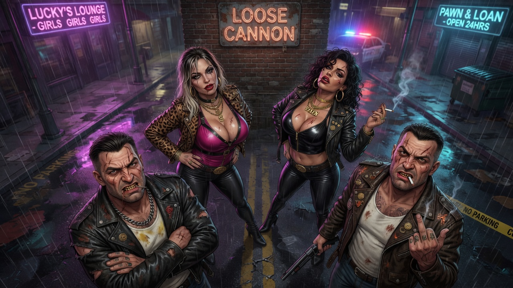
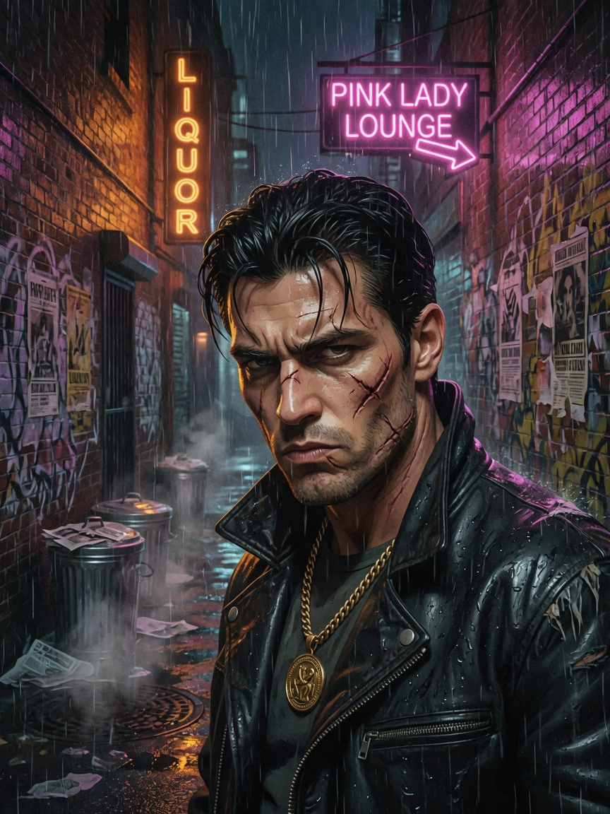
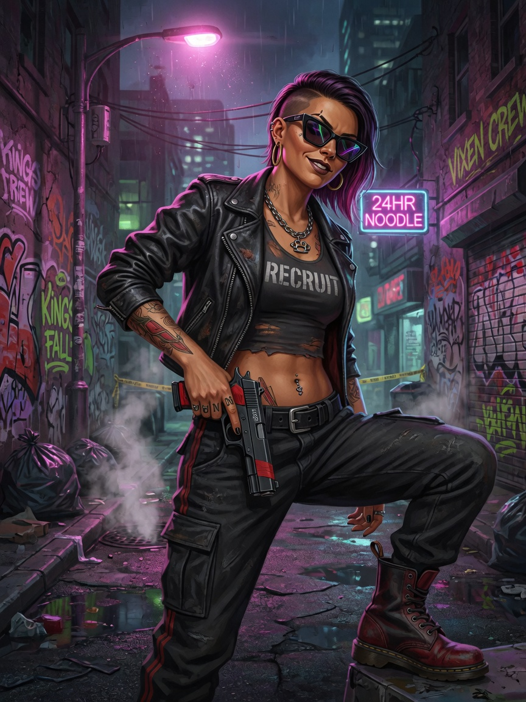
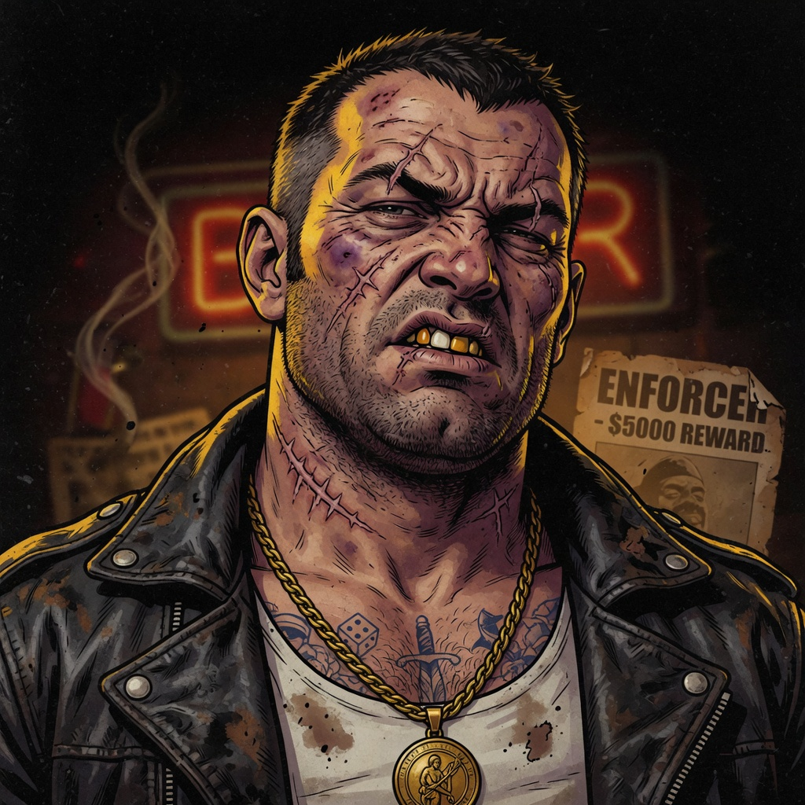
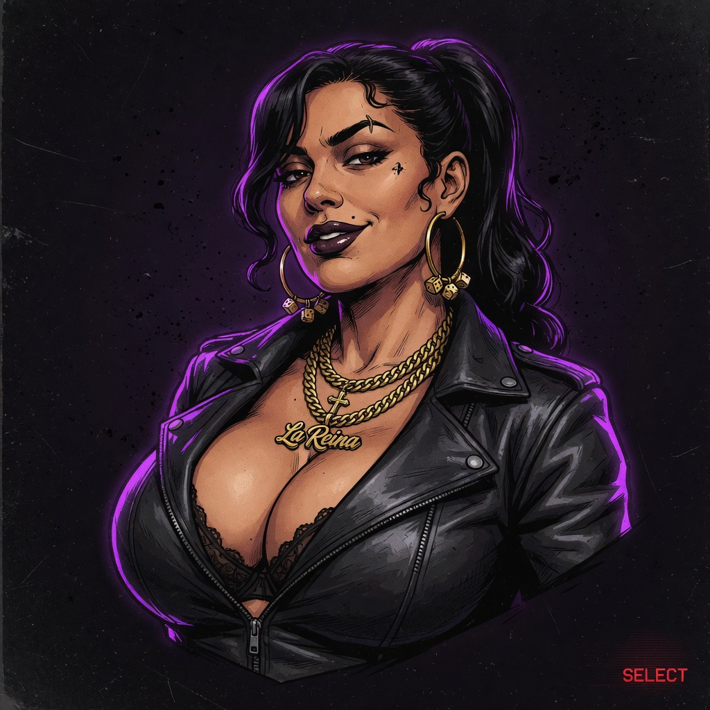
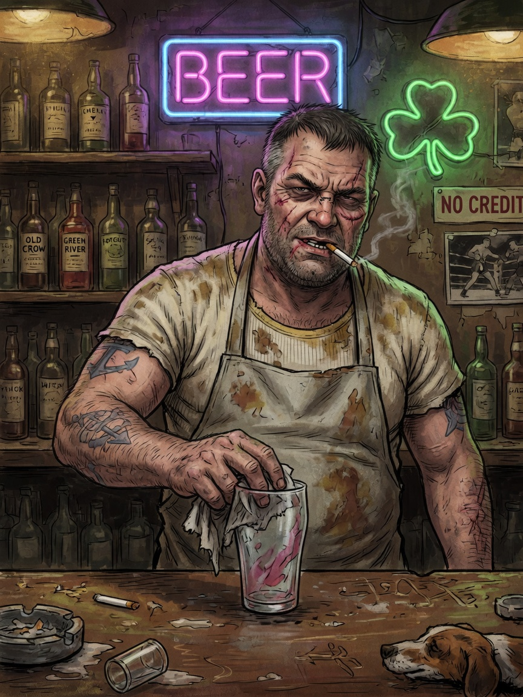
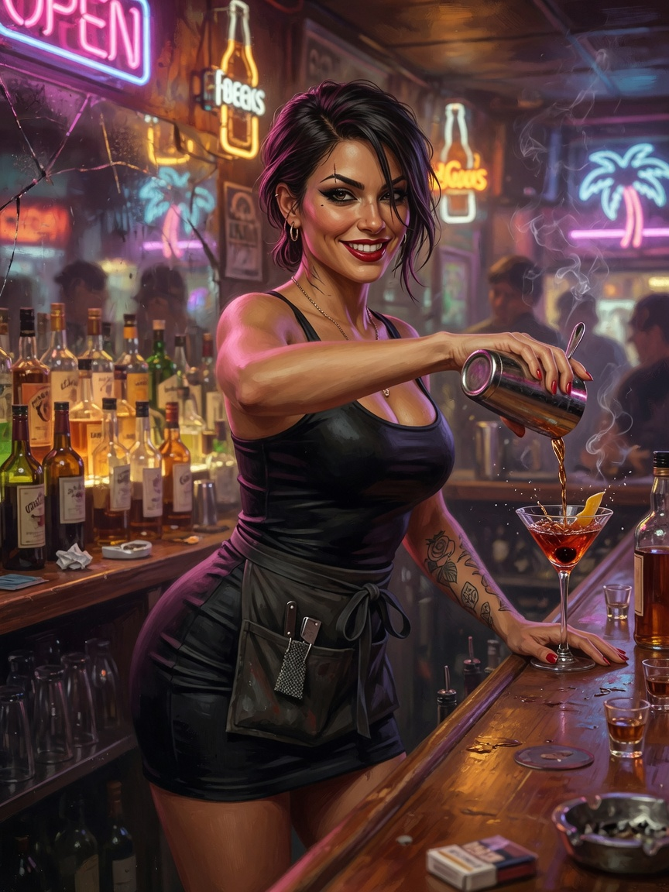

# Loose Cannon

Browser-based crime game — isometric squad tactics (*Syndicate*), crew comedy (*Cannon Fodder*), gangster recruitment (*Kingpin*).

<p align="center">
  
</p>

<p align="center">
  
  &nbsp;
  
  &nbsp;
  
</p>

<p align="center">
  
  
  
  
  
</p>

## 18+ only — content warning

**Loose Cannon is an adult-only game (18+).** By playing you confirm you are **18 years of age or older**.

Expect throughout the game:

- **Strong / explicit language** (Kingpin-style profanity and crude humor)
- **Violence**, street crime, and permanent (or long-lasting) crew deaths
- **Sexual themes and suggestive content** (e.g. gentlemen’s club venues, flirtation, adult humor)
- Dark comedy about gangs, money, and disposable “meat” — not a kids’ game

If that is not for you, do not play. There is no family-friendly mode.

---

## Play (local)

```bash
npm install
npm run dev
```

- Client: http://localhost:5173  
- Server: ws://localhost:3001 (in-memory, reset on restart)

### Controls

| Input | Action |
|-------|--------|
| **WASD / arrow keys** | Free movement (screen-aligned; diagonals work) |
| Left click | Click-to-move / select your unit |
| Right click | **Attack-move** — chase target if out of range, then fire |
| E | Interact (doors, NPCs, shop counter) |
| 1–4 | Select posse member |
| 5–0 / - | Quick-equip weapons (Syndicate-style slots) |
| FULL (panel) | Open full crew loadout editor |
| M | City district map |
| Enter | Focus proximity chat |
| Esc | Close dialogue / shop / editor |

Death: **3 second** respawn delay, then a random outdoor spot with few other players.

### What works

- Large isometric city (multi-avenue Skidrow)
- Free WASD + click move; RMB **attack-move** (chase + fire)
- Free outdoor roam (district rep is advisory for hot zones; shops/jobs still gate gear)
- Bars, pawn shop, gun shop, liquor, hospital, gym, **The Titty Twister**, church, garage, warehouse
- Dumpsters, protection corners, cars, crates (street hustles)
- Hire / recruit, shop with icons, crew loadout editor
- Combat scales with Aim / Muscle / weapons; wipe loot
- Job board / missions, heat meter, tutorial coach
- Basic Web Audio SFX + offline NPC voice lines
- Proximity chat

## Beta (Azure)

| | URL |
|--|-----|
| **Play** | https://loose-cannon-beta.azurewebsites.net |
| **Game server** | wss://loose-cannon-beta-server.azurewebsites.net |

Deploy: push to **`main`** → GitHub Actions builds and deploys both Web Apps.  
Setup (publish profiles + WebSockets): [`.github/DEPLOY.md`](./.github/DEPLOY.md)

```bash
npm run build:azure   # produces deploy/client + deploy/server
```

## Concept art

| | |
|--|--|
| Street combat (rain, neon, guns) |  |
| Splash / title mood |  |

More portraits and club art live under [`packages/client/public/art/`](./packages/client/public/art/).

## Docs

- [Game design](./docs/game-design.md)
- [Architecture](./docs/architecture.md)
- [Realms](./docs/realms.md) — segregated instances via login / `?realm=` (specified)
- [PRD](./docs/prd.md)
- [Status](./docs/STATUS.md) · [Master plan](./docs/MASTER_PLAN.md)
- [Automated overseer](./docs/OVERSEER.md) (Grok Build continuous development)
- [Azure deploy](./.github/DEPLOY.md)

### Keep developing with Grok (overseer)

```powershell
# Interactive goal mode
grok
# then: /goal … (see docs/OVERSEER.md)

# One headless cycle / continuous loop
.\scripts\overseer\run-cycle.ps1
.\scripts\overseer\overseer-loop.ps1 -Yolo -MaxCycles 5
```

## Inspiration

[`inspiration/`](./inspiration/)
